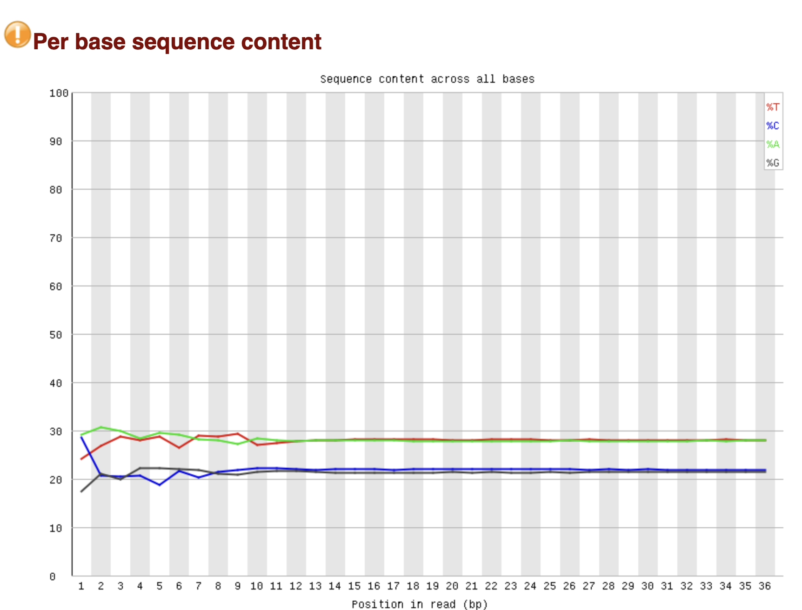

# hse_hw2_chip
## Анализ FastQC
### 1 реплика (ENCFF000BBJ)

Качество прочтений достаточно хорошее и под конец рида не сильно падает:

GC неплохой, близкий к идеальному:

Лишних адаптеров не нашлось:

### 2 реплика (ENCFF000BBK)

Качество прочтений даже лучше, чем у первой реплики:

GC состав примерно такой же, как для первой реплики:

Лишних адаптеров нет:

### Контроль (ENCFF000BAU)

Качество прочтений даже лучше, чем у первой реплики:

GC состав примерно такой же, как для первой реплики:

Лишних адаптеров нет:

